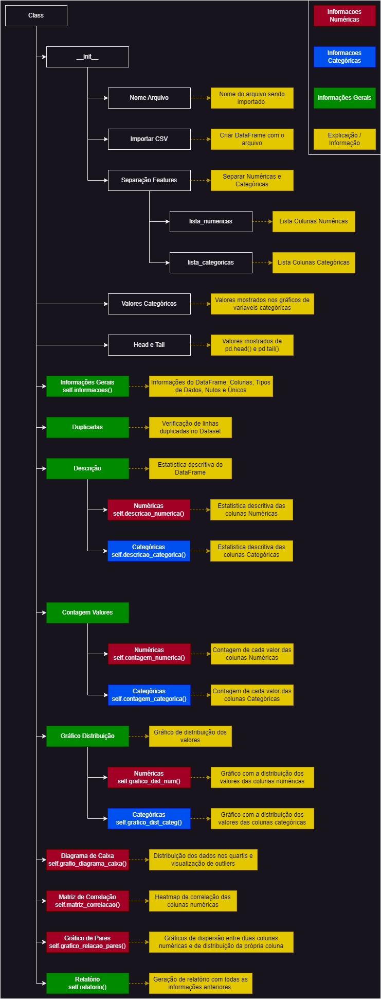

---

# Enunciado
Crie seu dataquality 

Utilizando de POO, crie um **módulo** que importado para um jupyter notebook crie um relatório como no pandas-profiling/YData-profiling/SweetViz.

Neste módulo, tera um método geral para análise de qualquer dataset:
- Contagem de nulos
- Contagem de valores únicos 
- .value_counts em colunas categóricas
- .describe nas colunas numéricas 
- gráficos de distribuição de colunas categóricas 
- gráficos de distribuição de colunas numéricas 
- ... 

E, usando do módulo desenvolvido, faça uma análise de um dataset escolhido no Kaggle.

- Grupos de até 3 pessoas;
- Repositório no github;
- Histórico no github;
- Entrega no 30/09 -> link do github

# Projeto - Análise de Qualidade de Dados com DataQuality

## Descrição

O projeto DataQuality é um módulo em Python desenvolvido para realizar análises de qualidade de dados em DataFrames, inspirado em ferramentas como pandas-profiling, YData-profiling e SweetViz. Este módulo tem como objetivo facilitar a análise exploratória de dados, exibindo informações importantes sobre os dados como contagem de valores nulos, contagem de valores únicos, análises descritivas de colunas numéricas e categóricas, gráficos de distribuição e diagramas de correlação.

O desenvolvimento do projeto foi iniciado com um fluxo das necessidades do projeto e descrição dos itens que devem ser desenvolvidos.

## Funcionalidades

- Informações do DataFrame: Exibe informações gerais do DataFrame, como tipos de dados e contagem de valores não nulos.

- Contagem de Nulos: Mostra a contagem e o percentual de valores nulos em cada coluna.
- Contagem de Valores Únicos: Exibe a contagem e o percentual de valores únicos para cada coluna.
- Análise Descritiva: Realiza a análise descritiva das colunas numéricas e categóricas, exibindo estatísticas como média, mediana, desvio padrão, entre outras.
- Gráficos de Distribuição: Gera gráficos de distribuição para as variáveis categóricas (gráficos de barras) e numéricas (histogramas com curva de densidade).
- Diagrama de Caixa (Boxplot): Exibe boxplots para visualizar a dispersão dos dados numéricos e identificar possíveis outliers.
- Matriz de Correlação: Apresenta uma matriz de correlação para as variáveis numéricas, permitindo a visualização das relações entre as variáveis.
- Relação de Pares (Pairplot): Cria gráficos de dispersão para examinar a relação entre todas as combinações de variáveis numéricas.

### Particularidades

- A função <code>grafico_dist_categ()</code> retorna a distribuição das variáveis categóricas. Para datasets com colunas com um grande número de valores únicos nas variáveis categóricas, a visualização gráfica pode ser impossibilidatada, seja pelo amontoado de informações em um único gráfico, seja pelo gráfico precisar ser exageradamente grande para comportar todos os números. Foi estipulado um número padrão dos 20 mais relevantes a serem exibidos. Caso seja necessário alterar, deve-se utilizar o setter <code>valores_categoricos</code>

## Bibliotecas Utilizadas

O projeto utiliza as seguintes bibliotecas:

- pandas: Manipulação de dados e análise.
- numpy: Operações numéricas e cálculos.
- matplotlib: Visualização de dados.
- seaborn: Visualização de dados com gráficos estatísticos.

Este projeto foi desenvolvido pelos alunos Nícolas Sartor Parisotto e Marcelo Neiva Henriques como parte do Módulo 3 do curso de Engenharia de Dados, ministrado pela ADA Tech em parceria com a Santander Academy. O objetivo do projeto é aplicar e consolidar os conhecimentos adquiridos durante o curso, focando na análise de qualidade de dados utilizando Python e suas principais bibliotecas.

Contribuições são bem-vindas! Sinta-se à vontade para enviar um pull request ou abrir uma issue para discutir melhorias e novas funcionalidades.
